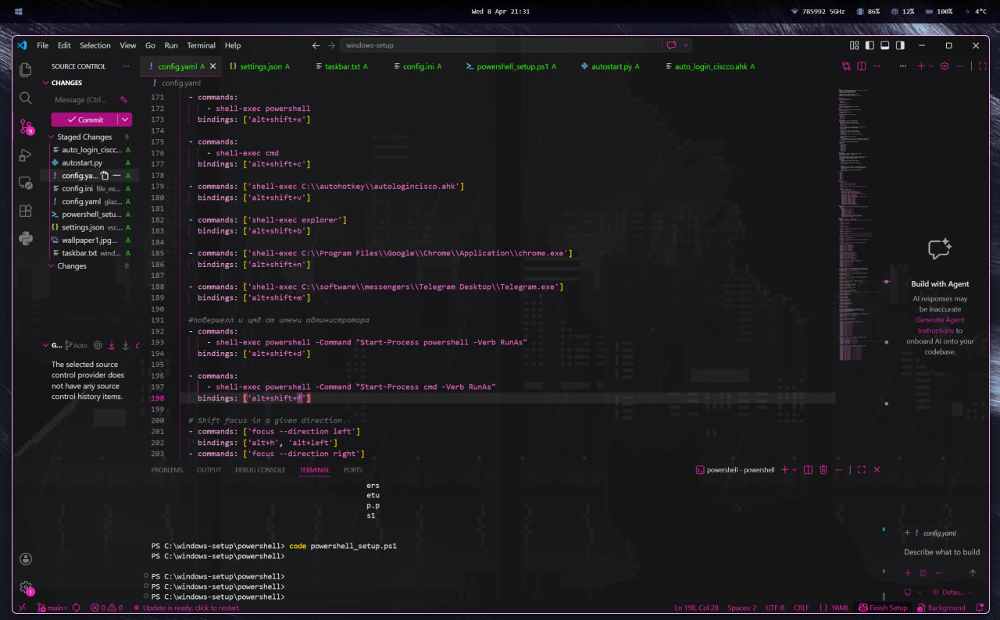
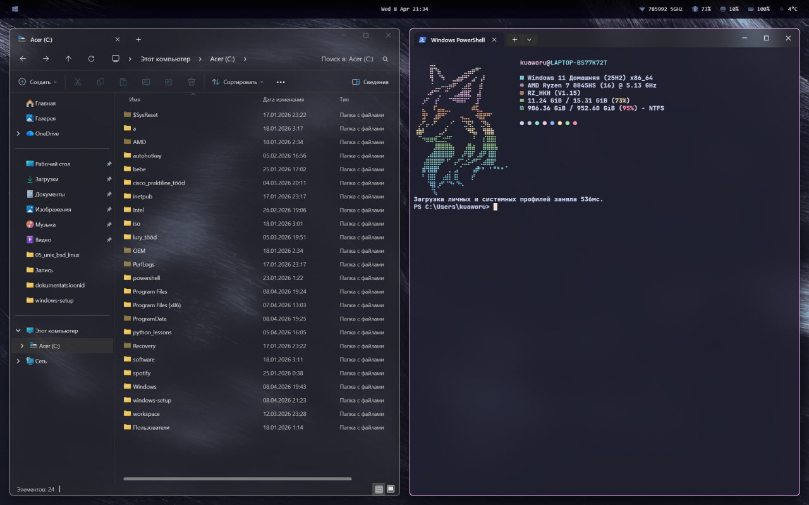
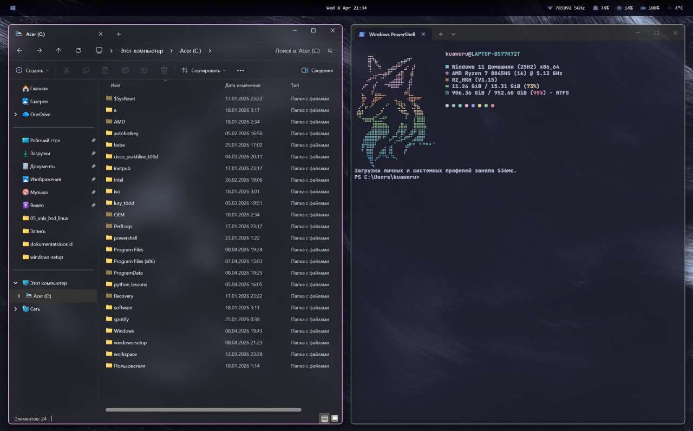

# windows-ricing
### windows ricing - кастомизация внешнего вида и поведения windows, приблизительнее к linux.

изначально я не планировала делать этот проект, но после того как я показывала свой windows своим друзьям, многие начали просить помочь им сделать также, поэтому я решила сделать этот проект с инструкцией.

---

# предварительный просмотр

---

## 1. glazewm

#### glazewm - это окнный менеджер для windows. он автоматически распологает окна исходя из кода.

в этом проекте использнуется конфиг из оригинального репозитория glazewm с небольшими изменениями, а именно изменения цвета рамки на розовую, неактивные окна становятся прозрачнее, добавленны новые горячии клавиши. 

#### установка glazewm

перейдите в этот репозиторий:
https://github.com/glzr-io/glazewm

справа будет кнопка releases, нажмите её. скачайте подходящий для вас, я скачивала - v3.9.1 Standalone Installer (x64)

### изменение интерфейса

в меню пуск введите glazewm, нажмите на него правой кнопкой мыши и затем запустить от имени администратора. далее glazewm должен появиться в системном трее(это стрелочка с мини окошками приложений на панели задач, находится правее), если же он там не появился, зайдите в настройки вашего компьютера - персонализация - панель задач, найдите другие значки панели задач и включите glazewm. в системном трее нажмите правой кнопкой мыши на glazewm, затем show config folder. скопируйте код с моего glazewm/config.yaml и замените его в вашем конфиге, который автоматически скачался с glazewm. сохраните и затем нажмите сочетание клавиш alt+shift+r - изменения должны примениться автоматически.
